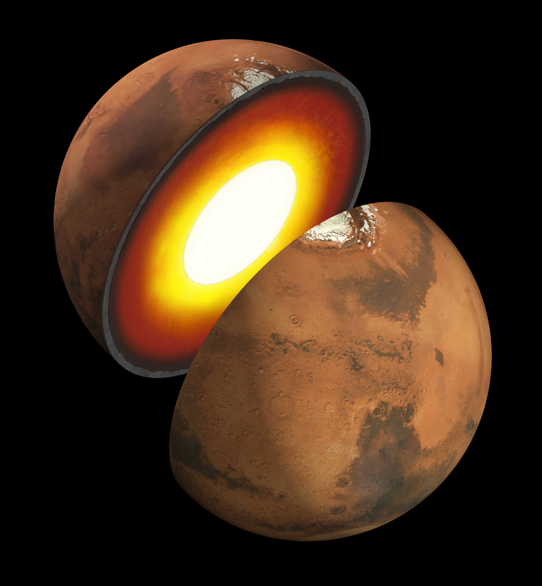
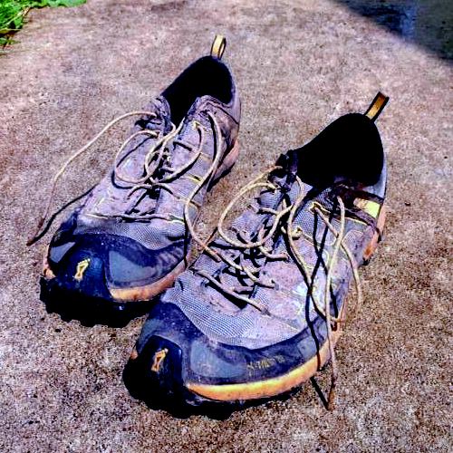
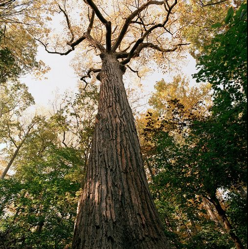
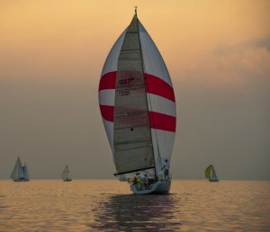
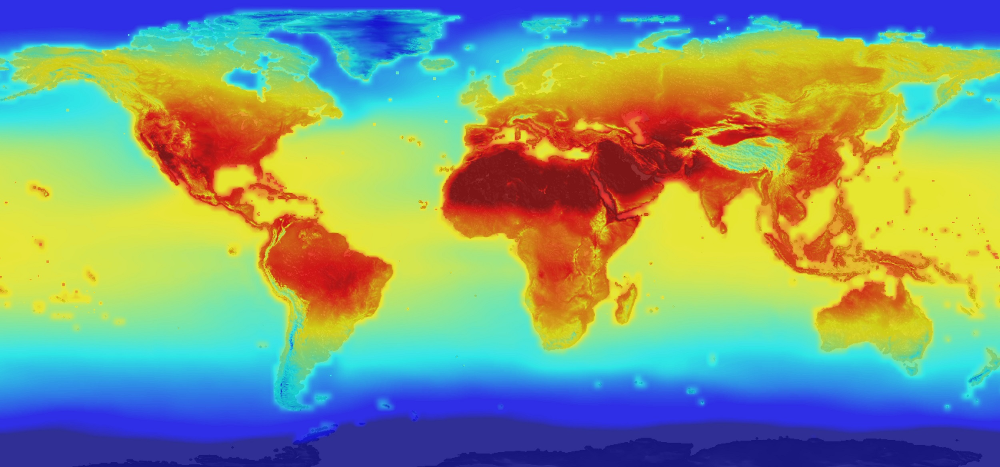

## Project #1
#### Insights from the Core of Mars

* * *

## Project #2 
#### 1,100 Runs; or, Empirical Confessions of an Aging Runner

* * *

## Project #3 
#### The Tallest Tree in the Big Apple...

* * *

## Project #4 
#### 5,000 Exoplanets, and counting...

* * *

## Project #5 
#### How to Educate a Robot

* * *

## Project #6 
#### Terror Prevention on the Open Seas

* * *

## Project #7
#### Exploring Global CO2 Emmissions

* * *

