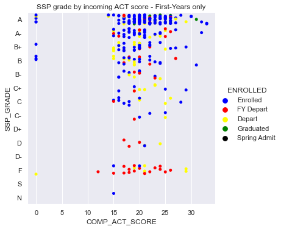
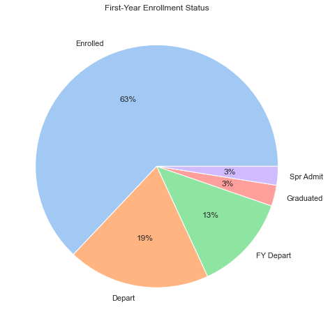
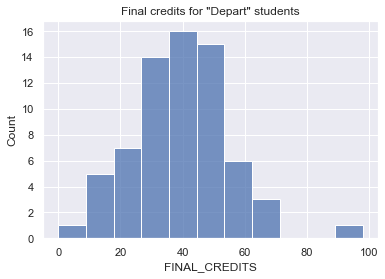
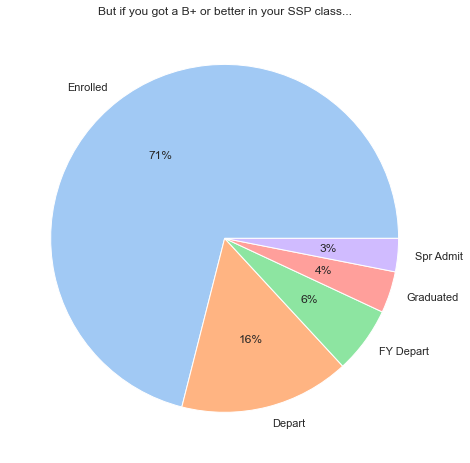

```python
import pandas as pd
import numpy as np
import matplotlib
from matplotlib import pyplot as plt
from matplotlib import rcParams
import seaborn as sns

sns.set()
```


```python
filename = 'Engineered_Query_Results_Nov_22.xlsx'
query = pd.read_excel(filename, sheet_name = 'Export Worksheet')
print(query.shape)
query.columns
```

    (745, 50)
    


    Index(['CLASS_TERM_CODE', 'CLASS_TERM_DESCR', 'CLASSES_TAKEN', 'SSP_GRADE',
           'EOT_GPA', 'EOT_CREDITS', '1183_GPA', '1183_CREDITS', '1189_GPA',
           '1189_CREDITS', '1193_GPA', '1193_CREDITS', '1199_GPA', '1199_CREDITS',
           '1203_GPA', '1203_CREDITS', '1209_GPA', '1209_CREDITS', '1213_GPA',
           '1213_CREDITS', '1219_GPA', '1219_CREDITS', '1223_GPA', '1223_CREDITS',
           'EMPLID', 'ENTRY_TERM', 'ENTRY_INSTITUTION', 'ENTRY_COLLEGE',
           'ENTRY_MAJOR', 'DEGREE_TERM', 'DEGREE_INSTITUTION', 'DEGREE',
           'DEG_YEAR_SPAN', 'IR_GENDER', 'IR_ETHNICITY', 'FGEN_STATUS',
           'HS_RANK_PCT', 'COMP_ACT_SCORE', 'TOEFL_TOT_SCORE', 'CLASS',
           'GPA_BEFORE', 'GPA_AFTER', 'GPA_DIFF', 'GPA_AFTER_2', 'GPA_DIFF_2',
           'LAST_TERM', 'GPA_BIN', 'FINAL_CREDITS', 'ENROLLED', 'FORMAT'],
          dtype='object')


```python
query['ENROLLED'].value_counts()
```


    Enrolled        474
    Depart          107
    Graduated        76
    FY Depart        60
    Spring Admit     28
    Name: ENROLLED, dtype: int64


```python
query['SSP_GRADE'] = query['SSP_GRADE'].astype('category')
query['SSP_GRADE'] = query['SSP_GRADE'].cat.set_categories(['A', 'A-', 'B+', 'B', 'B-', 'C+', 'C', 'C-', 'D+', 'D', 'D-',
          'F', 'S', 'N'], ordered=True)
```


```python
query['ENROLLED'] = query['ENROLLED'].astype('category')
query['ENROLLED'] = query['ENROLLED'].cat.set_categories(['Enrolled', 'FY Depart', 'Depart', 'Graduated', 'Spring Admit'], ordered=True)
```


```python
fy_only = query[query['CLASS'] == 'First-Year']
print(fy_only.shape)
```

    (481, 50)
    


```python
fy_only = fy_only[fy_only['CLASS_TERM_DESCR'] != 'Spr 2022']
print(fy_only.shape)
```

    (446, 50)
    


```python
fy_only = fy_only[fy_only['CLASS_TERM_DESCR'] != 'Fall 2021']
print(fy_only.shape)
```

    (359, 50)
    


```python
sns.catplot(data=fy_only, 
            x="COMP_ACT_SCORE", 
            y="SSP_GRADE", 
            hue="ENROLLED", 
            palette=['blue', 'red', 'yellow', 'green', 'black'], 
            legend='full', 
            jitter=.33).set(title='SSP grade by incoming ACT score - First-Years only')
plt.show()
```


    

    


```python
retention = fy_only['ENROLLED'].value_counts()
print(retention)
print()
total = retention.sum()
enrl = retention[0]
dpt = retention[1]
fy_dpt = retention[2]
grad = retention[3]
spr = retention[4]
net = total - spr
FY_ret = round((((net - fy_dpt)/net) * 100), 1)
gone = round((((net - fy_dpt - dpt)/net) * 100), 1)
print(f'First-Year retention rate: {FY_ret}%')
print(f'Long-term retention rate: {gone}%')
```

    Enrolled        226
    Depart           68
    FY Depart        46
    Graduated        10
    Spring Admit      9
    Name: ENROLLED, dtype: int64
    
    First-Year retention rate: 86.9%
    Long-term retention rate: 67.4%
    


```python
colors = sns.color_palette('pastel')
enrl_labels = ['Enrolled', 'Depart', 'FY Depart', 'Graduated', 'Spr Admit']

f = plt.figure()
f.set_figwidth(15)
f.set_figheight(8)

plt.pie(retention, labels=enrl_labels, colors = colors, autopct='%.0f%%')
plt.title("First-Year Enrollment Status")
plt.show()

print(f'First-Year retention rate: {FY_ret}%')
print(f'Long-term retention rate: {gone}%')
```


    

    


    First-Year retention rate: 86.9%
    Long-term retention rate: 67.4%
    


```python
humble = fy_only[fy_only['ENROLLED'] == 'Depart']
dep_cr = humble['FINAL_CREDITS'].mean()
print(humble.shape)
print(dep_cr)
sns.histplot(data = humble, x='FINAL_CREDITS').set(title='Final credits for "Depart" students')
```

    (68, 50)
    39.39705882352941
    


    [Text(0.5, 1.0, 'Final credits for "Depart" students')]


    

    


```python
top_marks = ['A', 'A-', 'B+']
top_fy = fy_only[fy_only['SSP_GRADE'].isin(top_marks)]
print(top_fy.shape)
```

    (259, 50)
    


```python
retention = top_fy['ENROLLED'].value_counts()
print(retention)
print()
total = retention.sum()
enrl = retention[0]
dpt = retention[1]
fy_dpt = retention[2]
grad = retention[3]
spr = retention[4]
net = total - spr
FY_ret = round((((net - fy_dpt)/net) * 100), 1)
gone = round((((net - fy_dpt - dpt)/net) * 100), 1)
print(f'First-Year retention rate: {FY_ret}%')
print(f'Long-term retention rate: {gone}%')
```

    Enrolled        184
    Depart           41
    FY Depart        16
    Graduated        10
    Spring Admit      8
    Name: ENROLLED, dtype: int64
    
    First-Year retention rate: 93.6%
    Long-term retention rate: 77.3%
    


```python
colors = sns.color_palette('pastel')
enrl_labels = ['Enrolled', 'Depart', 'FY Depart', 'Graduated', 'Spr Admit']

f = plt.figure()
f.set_figwidth(15)
f.set_figheight(8)

plt.pie(retention, labels=enrl_labels, colors = colors, autopct='%.0f%%')
plt.title("But if you got a B+ or better in your SSP class...")
plt.show()

print(f'First-Year retention rate: {FY_ret}%')
print(f'Long-term retention rate: {gone}%')
```


    

    


    First-Year retention rate: 93.6%
    Long-term retention rate: 77.3%
    


```python

```
